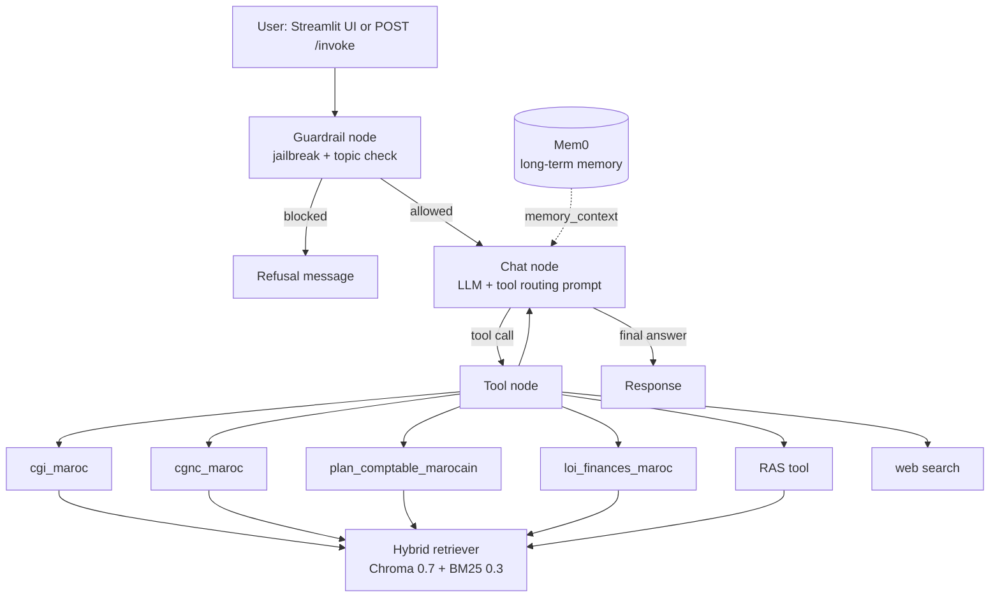

# 🇲🇦 Moroccan Accounting & Tax AI Agent

An agentic RAG assistant for Moroccan accounting and tax questions. It answers from the official texts (CGI, CGNC, Plan Comptable, Finance Laws) instead of from model memory, routes each question to the right knowledge base, and can read scanned invoices through OCR.

Built with **LangGraph**, **LangChain**, **FastAPI** and **Streamlit**.

---

## Features

- **Agentic RAG**: a LangGraph agent decides which knowledge base to query and loops until it has enough context
- **Hybrid retrieval**: Chroma dense search (70%) + BM25 keyword search (30%), which suits legal text where exact terms and article numbers matter
- **Four Moroccan knowledge bases**:
  - **CGI**: Code Général des Impôts 2026 (IS, IR, TVA, withholding, penalties…)
  - **CGNC**: Code Général de Normalisation Comptable
  - **Plan Comptable**: Moroccan chart of accounts
  - **Lois de Finances**: 2024, 2025 and 2026 annual changes
- **RAS knowledge base** for withholding tax (retenue à la source)
- **Web search** (SerpAPI) for exchange rates and recent news
- **OCR** for images and PDFs (GLM-OCR) to read invoices and receipts
- **Guardrails**: jailbreak detection and topic restriction before the LLM is called
- **Long-term memory** via Mem0, injected through the run config so it never pollutes the checkpointed thread history
- **Evaluation and red-teaming** labs (RAGAS, PyRIT)

---

## Architecture



**Tool routing** (defined in the system prompt):

| Question type | Tool |
| :--- | :--- |
| Account number needed | `plan_comptable_marocain` |
| Accounting rule or principle | `cgnc_maroc` |
| Permanent tax rate or tax law | `cgi_maroc` |
| Annual tax change, year mentioned | `loi_finances_maroc` |
| Current news, exchange rates, outside info | `google_ssearch` |

---

## Example

**User**

> Quel est le taux de TVA applicable aux exportations de biens et services au Maroc ?

**Agent**

> Les exportations de biens et de services sont exonérées de TVA avec droit à déduction, sous réserve de justifier l'exportation par les documents appropriés.

---

## Tech stack

| Layer | Tools |
| :--- | :--- |
| Orchestration | LangGraph, LangChain |
| LLM | OpenAI `gpt-4o-mini` (OpenRouter supported via `langchain-openrouter`) |
| Retrieval | Chroma, BM25, OpenAI embeddings, SemanticChunker |
| Memory | LangGraph `MemorySaver` (thread) + Mem0 (long-term) |
| Safety | Guardrails AI (`DetectJailbreak`, `RestrictToTopic`) |
| OCR | GLM-OCR (Hugging Face Transformers), PyMuPDF |
| API / UI | FastAPI, Streamlit |
| Evaluation | RAGAS, LangSmith, PyRIT |

---

## Installation

**Requirements:** Python 3.10+ (a GPU is recommended for OCR).

```bash
git clone https://github.com/ILIASB1212/accountant_ai_agent_v3.git
cd accountant_ai_agent_v3

python -m venv .venv
source .venv/bin/activate        # Windows: .venv\Scripts\activate

pip install -r requirements.txt
pip install -e .
```

## Environment variables

Create a `.env` file at the project root:

```env
OPENAI_API_KEY=your_openai_key
LANGSMITH_API_KEY=your_langsmith_key
MEM0_API_KEY=your_mem0_key
SERPAPI_API_KEY=your_serpapi_key
```

## Run

**Streamlit app** (chat + OCR upload):

```bash
streamlit run src/main.py
```

**API:**

```bash
uvicorn src.endpoint:app --reload
```

```bash
curl -X POST http://localhost:8000/invoke \
  -H "Content-Type: application/json" \
  -d '{
        "thread_id": "demo",
        "messages": [{"role": "user", "content": "Quel est le taux de l'\''IS au Maroc ?"}]
      }'
```

The response is plain text: a timing line followed by the answer.

**Rebuilding the vector stores:** the retrievers load the persisted stores from `artifacts/vectorestore/`. To rebuild one from the PDFs in `data/`, set `force_rebuild=True` in the corresponding tool file under `src/tools/`.

---

## API

### `POST /invoke`

| Field | Type | Description |
| :--- | :--- | :--- |
| `thread_id` | string | Conversation id; keeps the thread history |
| `messages` | list | Chat messages for this turn |

---

## Evaluation

The agent is evaluated on a 52-question golden set (`Moroccan_Accounting_Golden_V2`) with RAGAS, run on 2026-09-28.

| Metric | Score |
| :--- | :--- |
| Answer Relevancy | 0.79 |
| Context Precision | 0.78 |
| Context Recall | 0.65 |
| Answer Correctness | 0.55 |
| Faithfulness | 0.46 |

Full per-question results are in [`laboratoire/evaluation/`](laboratoire/evaluation/).

**Red-teaming:** PAIR and Crescendo attacks were run with PyRIT against the agent (`laboratoire/redteam/`). All attempts failed to reach the attacker's objective. The set is small and covers one objective, so treat it as a first pass, not a full security audit.

---

## Project structure

```
.
├── config/                 # config.yml
├── data/                   # Source PDFs (CGI, CGNC, Plan Comptable, Lois de Finances, RAS)
├── artifacts/vectorestore/ # Persisted Chroma + BM25 indexes
├── laboratoire/            # Notebooks, RAGAS evaluation, PyRIT red-team scripts
├── src/
│   ├── agentic_workflow/   # LangGraph agent (agent.py)
│   ├── data_ingestion/     # Loader, chunking, embeddings, vector store
│   ├── PipeLine/           # RAG build/load pipeline
│   ├── protection_rail/    # Guardrails node
│   ├── memory/             # Mem0 long-term memory
│   ├── tools/              # Retriever tools, web search, OCR
│   ├── endpoint.py         # FastAPI app
│   └── main.py             # Streamlit app
└── requirements.txt
```

---

## Known limitations

- **Journal entries**: the agent can pick the wrong accounts or skip the VAT split on purchase entries. Always verify generated entries before posting them.
- **Faithfulness** is the weakest metric (0.46); answers can drift beyond the retrieved text.
- Thread state uses an in-memory checkpointer, so conversations are lost on restart.
- The Streamlit app uses a fixed memory `user_id`; it is a single-user setup.
- This tool is an assistant, not a replacement for a qualified accountant or tax advisor.

## Roadmap

- [ ] Structured journal-entry generation with a debit = credit check and VAT splitting
- [ ] Article-level chunking with metadata (source, article number, year) for precise citations
- [ ] Persistent checkpointer and per-user memory
- [ ] Domain-specific red-team set (prompt injection via tools, data leakage)
- [ ] CI with regression tests on the golden set

---

## Author

**Ilias Baher**: AI/ML engineer (LangGraph, RAG, FastAPI) and finance & accounting student, Casablanca.
[GitHub](https://github.com/ILIASB1212) · Fiverr / Upwork: `iliasbaher`
